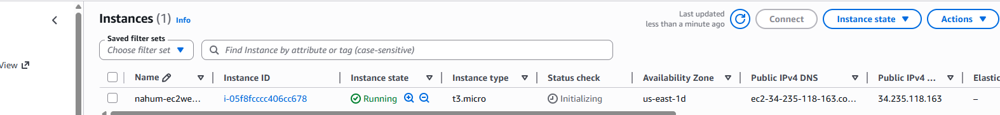
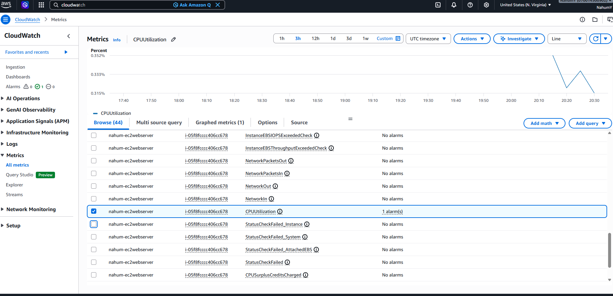
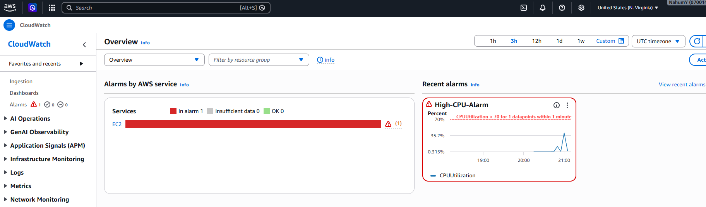
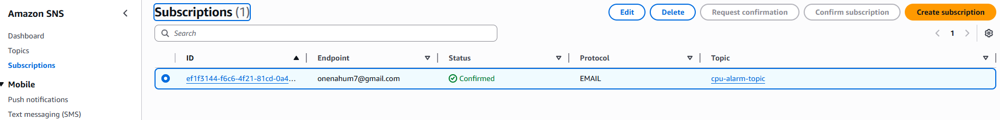

# AWS CloudWatch CPU Alarm Project

This project demonstrates how to monitor an EC2 instance using Amazon CloudWatch and trigger an alarm when CPU usage exceeds 70%.

## What I Built
- Created an EC2 instance
- Installed and ran a CPU stress test
- Created a CloudWatch alarm for CPU > 70%
- Connected the alarm to an SNS topic
- Received an email notification when the alarm triggered

## Screenshots

### EC2 Instance

### CloudWatch Metrics

### Alarm Configuration

### SNS Subscription

### Alarm Triggered (ALARM State)

### Email Notification
*(Upload your email screenshot to the screenshots folder and add it here)*
